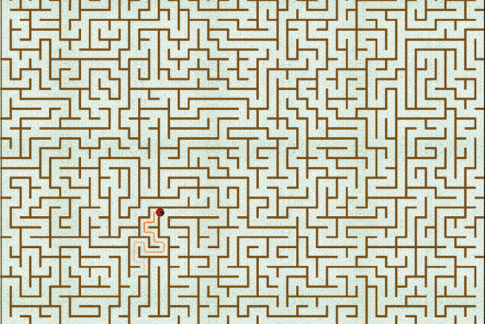
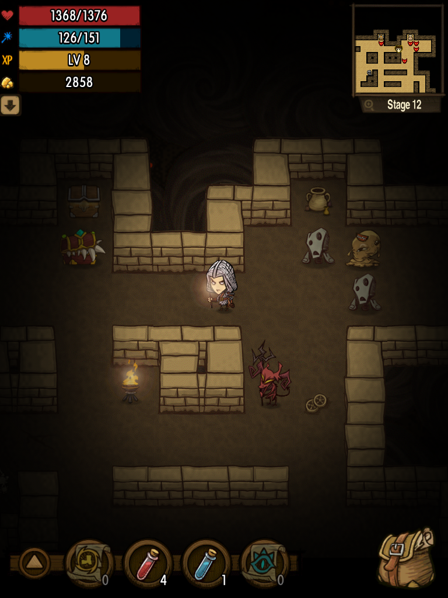
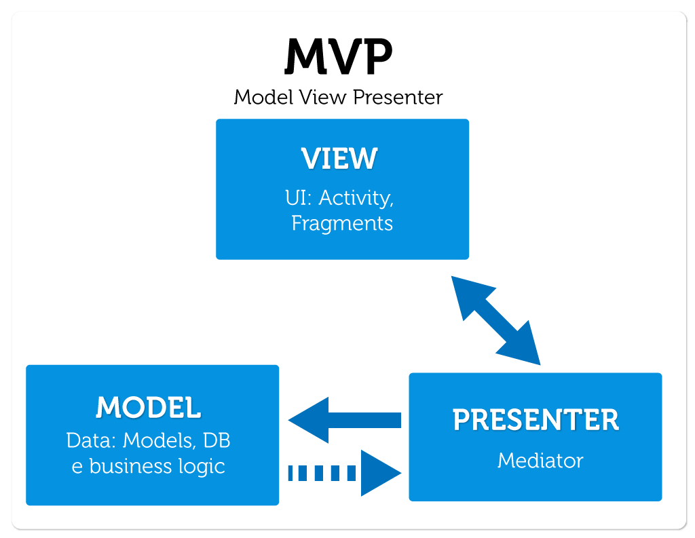

#Лабиринт  

Если вы собираетесь это читать, то не надо.

## Концепция

Программа представляет собой логическую игру. Планируется использование 2D графики и вида сверху.

Планируемое приложение будет предоставлять пользователю возможность пройти лабиринт. 
На следующем изображение приведён скриншот игры [Король лабиринта] (https://play.google.com/store/apps/details?id=com.mobirix.playmaze)

Цель игры будет похожа, пройти лабиринт. 

Управление будет аналогично следующей игре, [The Greedy Cave](https://play.google.com/store/apps/details?id=com.avalon.cave)

Таким образом планируется создать 2D лабиринт, перемещаться по которому пользователь будет нажатием на ячейку, в которой он пожелал оказаться.
Карты лабиринтов будут статичными.

Расширение функциональности:

- Чтобы усложнить задачу прохождения, пользователь не сможет видеть весь лабиринт целиком. Было решено сделать карту, на которую будут наноситься 
те участки на которых игрок уже побывал, таким образом он сможет осознано блуждать по лабиринту.

- Будут добавлены задачи, типа: найди ключ от двери, чтобы пройти дальше.

- Препятствия: скрытые(трудно распозноваемые) ловушки.

- Скрытые стены. 

При разработке планируется использование фреймворка [LibGDX](http://libgdx.badlogicgames.com)

## Минимально работоспособный продукт

Небольшой лабиринт, с возможностью его прохождения

## Диаграмма компонентов

Планируется использование патерна [MVP](https://ru.wikipedia.org/wiki/Model-View-Presenter)

