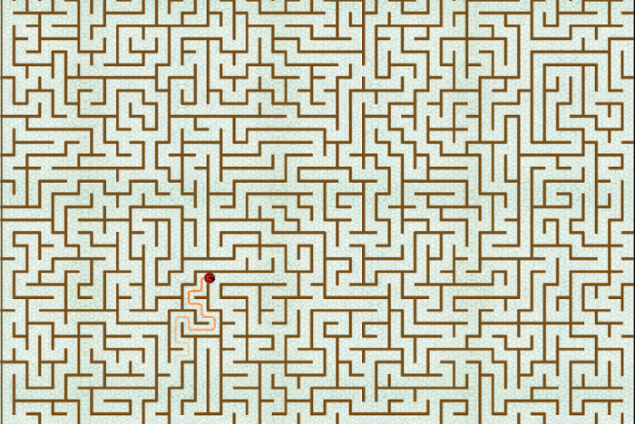
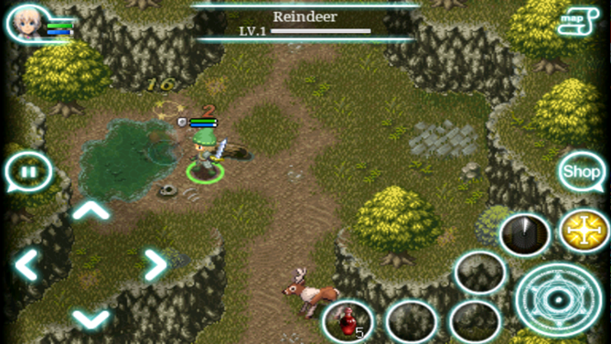

#Игра в жанре 2D top-down rpg

Если вы собираетесь это читать, то не надо.

## Задание

Создать игру под Android

## Концепция

Программа представляет собой игру 2D top-down rpg, в которой пользователю 
предоставляется возможность исследовать лабиринт

В итоге планирается какая-то смесь этого 

с этим 

Расширение функциональностей:
- самогенерирующийся лабиринт
- добавление(увеличение количества) интерактивных объектов

При разработке планируется использование фреймворка [LibGDX](http://libgdx.badlogicgames.com)

## Минимально работоспособный продукт

Небольшой лабиринт, с возможностью его прохождения

## Диаграмма компонентов

Планируется использование патерна [MVC](https://ru.wikipedia.org/wiki/Model-View-Controller)

